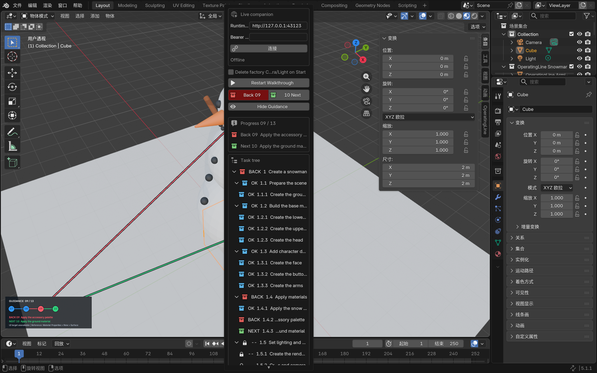
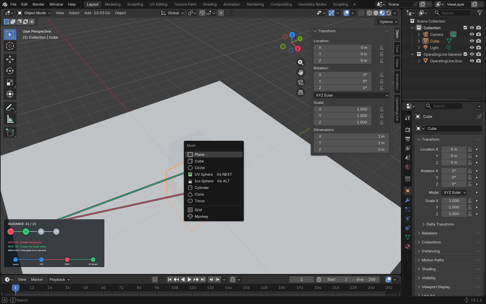

# OperatingLine

[](https://github.com/Lemonadeccc/OperatingLine/actions/workflows/ci.yml)
[](LICENSE)

> 当前阶段：`0.1.0` 垂直切片。Blender 内引导与本地 Orchestrator ↔ Companion
> 计划投递/状态回传闭环已可运行；用户现在可以直接在 Blender 的 `Goal to Guidance` 输入目标，
> 再由 Codex、Claude 或其他 MCP 客户端发现不可变请求、取得精确 Planner Packet，并提交只返回该
> Blender 实例的待审 GuideProposal；若显式 Runtime 已配置 Provider，用户也可以留在 Blender 中查看
> 数据传输/可能费用、逐次确认异步 Initial Plan Run。两条路径最终都只创建待审 Proposal。用户在
> Blender 内预览完整任务树并明确接受或拒绝。用户还可从活动树或待审树引用节点、提交不可变修订
> 请求，再由外部 MCP 客户端返回只投递给该 Blender 实例的完整新版 Proposal。内置计划可完成并
> 回退一张确定性的雪人渲染预览。
> Orchestrator 现在可以查询 Blender `1.12.0` ActionCatalog 和 PlanningContext，并导出带冻结快照游标
> 与内容哈希的 Eval/replay 原始证据。仓库还提供独立、无分数的人工 Eval 协议、内部
> `@operatingline/eval-kit`、7 个 `collecting` Blender 案例，以及本地
> `eval:snapshot` → `eval:manifest` → `eval:capture` → `eval:blind` → `eval:status`/`eval:review` →
> `eval:check`/`eval:report` 采集与盲审工具链；当前尚无真实 Provider Run、blind sign-off 或人工
> annotation。修订请求现在支持持久化线性多轮 thread；每个返回提案都带
> 精确 Plan diff，并在 Blender 内显示节点与简单参数前后值。结构化修订消息历史现在可分页回放，
> Blender 可展开或继续加载更早轮次。跨目标规划现在还有版本化阶段画像、确定性质量门和一个在
> Blender 4.5/5.1 中真实执行的机器人基准。当前 `1.12.0` 目录提供十四项 `semanticCapabilities`，要求
> provider 把具体目标需求映射到目录能力和可执行叶子。版本化 Planner Packet 还能通过 MCP Prompt、Tool 或
> HTTP 把同一份上下文、严格输出 Schema 和 evaluate→propose 工作流交给客户端自己的模型；运行时
> 也可显式注入进程内 Planner Provider，生成经严格验证但尚未提交的初始草案。节点修订现在还有独立
> capability-aware `PlanningPromptPacket` / `ReplanningPromptPacket 1.1.0`、引用子树 locality 门禁和可选
> provider `replan()`；历史目录继续使用 `1.0.0` packet 精确回放。MCP 客户端仍以
> 两个显式步骤完成 generate 与 propose。Blender 用户现在也可在 Runtime 确认 Goal 或 revision request
> 后，明确选择一个已注册 Provider、查看数据传输/可能费用披露，并逐次确认异步 Initial Plan Run 或
> Replan Run；Runtime 只在 canonical
> 结果 ready 时创建待审 Proposal，之后仍必须在 Blender Accept/Reject。仓库提供一个同时支持初始/局部规划的可选 OpenAI Responses Provider、
> 本机 Codex/Claude CLI Provider 和各自独立的 opt-in composition root；默认 standalone 仍不加载这些
> Provider 或凭据。MCP HTTP 与 stdio bridge 已自动协商稳定版 `2026-07-28`，同时兼容旧客户端。Blender 内已有可折叠的
> Revision Workspace，用于结构化节点引用、Provider handoff、Run 状态、历史、diff 和提案审批；ActionCatalog 还新增了
> 有界整网格 Subdivide/Triangulate、显式连通面区域 Extrude、非应用 Bevel/Solidify Modifier、首个 Transform Geometry Nodes、显式归一化蒙皮权重和
> pose location/rotation/scale 动画切片。完成真实采集与独立盲审的任意目标语义数据集、
> 自动评分/训练治理和第二宿主仍在路线图中。

OperatingLine 是一套面向 AI/MCP 软件操作的可观察引导协议与宿主适配框架。

## 问题与价值

当 AI 通过 MCP 操作 Blender 等复杂软件时，用户往往只看到最终结果：不知道 AI 当前在做什么、
为什么这样做、操作了哪个对象，也难以定位需要修改的步骤。

OperatingLine 把高层目标拆成可引用的任务树，再把可执行叶子节点绑定到语义动作、
宿主内锚点、完成验证和回退策略。用户可以看到当前步骤，按顺序前进或回退，并用
`1.2.1` 这样的编号精确引用某个节点。

OperatingLine 不在目标软件外叠加透明窗口。任务树、引导线和操作控件由每个宿主的原生
Companion/Extension 在软件内呈现；无界面 Orchestrator 负责协议验证、计划发布或提案、
本地 Companion 投递、人工决策、状态查询、事件记录和能力描述。

## 真实可运行能力

- **Headless Orchestrator**：提供经鉴权的 MCP/HTTP 接口，可验证和直接发布 GuidePlan，也可
  持久化 AI GuideProposal、按宿主实例投递并记录幂等的接受/拒绝决策；同时查询最新执行状态，
  把追加式事件与每个实例的最新快照写入本地数据库。
- **本地 AI 客户端接入**：提供 Codex CLI、Codex 本地桌面端和 Claude Code 共用的回环 HTTP MCP
  配置入口，以及 Claude Desktop 使用的 MCPB stdio→HTTP 薄连接器。安装器只保存 Token 环境变量
  引用，MCPB 只接受精确 loopback `/mcp` 地址；Runtime connection instructions（现代
  `server/discover` / 旧版 `initialize`）会把
  `pending request → exact packet → evaluate → propose → Blender review` 工作流交给客户端，连接本身
  不授予执行权限。
- **Blender 内逐次调用本机 CLI Planner**：`pnpm dev:clients` 显式注册 Codex CLI 与 Claude Code CLI。
  Blender 复用已有 Provider 列表、远程数据/可能费用披露和原生确认 dialog；Runtime 仅把精确 Planner
  Packet 通过 stdin 交给 CLI，并把返回 JSON 送入相同的严格目录、coverage、quality/locality 与 Proposal
  审批边界。Codex 使用临时空目录、ephemeral/read-only 和无 shell 环境继承；Claude 禁用 tools、配置
  与 session persistence，并默认限制每次最多 1 USD。两者都不获得 OperatingLine Token，也不能直接
  执行 Blender action。桌面 GUI 没有稳定 headless API，仍由用户在 GUI 内通过 MCP 发起任务。
- **MCP `2026-07-28` 与签名分发**：HTTP Runtime 由官方 SDK 提供现代/旧版双时代入口；stdio bridge
  上下游均自动协商新版并保留旧版回退。Claude Desktop 包可构建 unsigned、临时自签名开发包，或使用
  外部证书/私钥生成并验证生产签名包；仓库不包含生产私钥，自签名也不代表公开可信。
- **版本化协议**：定义 GuidePlan、GuideProposal/Decision、树/DAG、语义锚点、动作绑定和能力画像，并生成
  JSON Schema 与跨语言 fixture。
- **不可变 ProcedureTree 操作检索**：Runtime 把已保存树中的 semantic operation 和 available 的菜单、
  快捷键、MCP operation 规范化索引，并通过 `operatingline.procedure.search` 与
  `POST /api/v1/procedure/search` 提供 AND 组合的精确结构筛选。命中项保留 tree revision/完整性、节点
  路径、leaf 验证状态、轨迹、来源和证据；unavailable 轨迹不返回。分页使用独立的存储
  `indexSequence`，不把它当作 operation 顺序；接口不做向量/相似度检索，也不执行宿主动作。见
  [ADR 0044](docs/adr/0044-exact-procedure-operation-index.md)。
- **自然语言 Procedure 编写 Packet**：MCP `operatingline.procedure.prompt.get` 与 HTTP
  `POST /api/v1/procedure/prompt` 返回供应商无关的 `1.0.0` packet，精确绑定 ActionCatalog、
  InteractionCatalog、tree identity、goal source/evidence 和 candidate-only 响应 Schema。当前 MCP
  宿主模型按 packet 生成层级、语义 operation 和 Action 参数；模型输出中的菜单、快捷键与 MCP 轨迹必须保持
  unavailable，不能自行完成 grounding。精确检索目前只提供 grounding 候选，随后
  把原 packet 与候选提交给 `operatingline.procedure.authoring.validate`；服务端核对 canonical SHA-256、
  已安装目录快照、candidate-only 契约和固定 provenance，并复用既有 compile。Packet 不再重复内嵌 rendered
  prompt，且以 256 KiB canonical 大小 fail closed。该入口不调用模型、不自动保存树、创建 Proposal 或执行
  宿主；当前也没有向量/语义 RAG、完整 Procedure Provider coordinator、可视化编辑器或训练导出。见
  [ADR 0045](docs/adr/0045-provider-neutral-procedure-authoring.md)。
- **目录绑定的 Procedure 轨迹物化**：供应商无关的 MCP
  `operatingline.procedure.authoring.materialize` 与 HTTP
  `POST /api/v1/procedure/authoring/materialize` 接受上述同一 packet + candidate，并重新执行 packet-bound
  validation。只有 InteractionCatalog 的封闭声明可启用轨迹。Blender InteractionCatalog `1.17.0` 为
  UV Sphere 生成七步菜单，
  以及 `Shift+A`、`G → X/Y/Z`、`S`、`F2` 六步候选快捷键轨迹；`keyMode` 明确区分 chord/sequence，
  `vector3_x/y/z` 把位置值绑定到对应移动步骤。每条替代轨迹都必须独立完整映射或省略 Action 参数，内部
  `resourceId` 不进入 UI operation。Icosphere 同版本生成四步原生菜单加 Location、Object Name 两步参数
  控件，精确保留 `subdivisions`、`radius`、`location` 和 `objectName`，但不虚构 shortcut 或 MCP；MCP
  仍因没有真实 action-level tool 而 unavailable。Cube 与 Plane 同版本各生成六步 ordered menu：四步原生
  guidance 的最终 operator 以 identity 投影绑定 accepted action 的 `size`，随后依次绑定 Location 与 Object
  Name；`size` 是完整边长，不是 Blender transform scale，内部 `resourceId` 同样省略，shortcut/MCP 均
  unavailable。Torus 同版本在 operator step 按顺序绑定 `major_segments`、`minor_segments`、literal
  `mode: MAJOR_MINOR`、`major_radius` 与 `minor_radius`，再绑定 Location 与 Object Name；内部 `resourceId` 同样省略，
  shortcut/MCP 均 unavailable。Cone 同版本生成六步 ordered menu：四步原生 guidance 的 operator step 严格按序绑定
  `vertices: 32`、`radius1 ← radiusStart`、`radius2 ← radiusEnd`、`depth ← distance`、
  `end_fill_type: NGON`、`calc_uvs: false`、`enter_editmode: false`、`align: WORLD`、
  `location: [0,0,0]`、`rotation` 与 `scale: [1,1,1]`，然后绑定中点 Location 与 Object Name。封闭
  `derived_action_arguments`/`segment_frame` 声明要求 `distance`、`midpoint` 与
  `rotation_euler_xyz_align_z` 三个输出各恰好出现一次。设
  `dx = end[0]-start[0]`、`dy = end[1]-start[1]`、`dz = end[2]-start[2]`，则
  `horizontal = hypot(dx,dy)`、`distance = hypot(horizontal,dz)`、`midpoint = (start+end)/2`，
  `rotation = [0,atan2(horizontal,dz),horizontal===0?0:atan2(dy,dx)]`，所有 `-0` 规范化为 `0`。
  该 canonical zero-roll XYZ Euler 把本地 `+Z` 对齐 `end-start`；本地 `-Z`/`radius1`
  对应 `start`/`radiusStart`，本地 `+Z`/`radius2` 对应 `end`/`radiusEnd`。它只是确定性对齐约定，
  不声称与 managed executor 的 quaternion/roll 精确等价。Cone 同样省略 `resourceId`，shortcut/MCP 均 unavailable。UV Sphere shortcut 结果格式仍为 `1.2.0`，Icosphere、Cube、Plane、Torus 与 Cone
  的 menu-only 结果格式为 `1.1.0`。旧 `1.10.0` 四步菜单、`1.11.0` 七步菜单、`1.12.0` UV Sphere
  快捷键、`1.13.0` Icosphere、`1.14.0` Cube 与 `1.15.0` Plane 菜单结果保持
  精确回放。结果带已安装目录 digest、输入/输出 tree hash 与逐 leaf coverage。leaf 仍为 `candidate` 且
  `validatedHostVersions` 为空，通用 compile 仍是 `structural_only`；
  radius→scale 与相对移动只是教学投影，不是宿主状态等价证明。历史
  `1.9.0`/`1.10.0`/`1.11.0`/`1.12.0`/`1.13.0`/`1.14.0`/`1.15.0`/`1.16.0` 保持可回放；`1.16.0` 已冻结。只有完整 result 信封保留目录
  grounding 证明；单独抽出或经通用 store 保存的 tree 仍只能
  按 `structural_only` 使用。该入口不调用模型或 Provider、不保存树、不创建 Proposal，也不执行 Blender；
  当前 Icosphere、Cube、Plane、Torus 与 Cone 轨迹都未经过完整 UI operation 的真实 Blender replay。Cone 的 Blender 4.5/5.1 原生 operator 双版本探针也不等于六步 UI replay。原生菜单/operator 不能复现 action executor 的 managed
  collection 归属、resource tag、receipt、幂等或补偿语义。见
  [ADR 0046](docs/adr/0046-catalog-bound-procedure-materialization.md) 与
  [ADR 0047](docs/adr/0047-ordered-procedure-parameter-operations.md) 与
  [ADR 0048](docs/adr/0048-candidate-shortcut-procedure-materialization.md) 与
  [ADR 0049](docs/adr/0049-icosphere-ordered-menu-materialization.md) 与
  [ADR 0050](docs/adr/0050-cube-ordered-menu-materialization.md) 与
  [ADR 0051](docs/adr/0051-plane-ordered-menu-materialization.md) 与
  [ADR 0052](docs/adr/0052-torus-ordered-menu-materialization.md) 与
  [ADR 0053](docs/adr/0053-cone-segment-frame-menu-materialization.md)。
- **ActionCatalog 与 PlanningContext**：MCP 客户端可以查询目标宿主真实允许的动作版本、参数
  Schema、资源读写、观察、回退、安全边界、适配器自有 `semanticCapabilities`、最新 Companion 状态和
  下一 Plan revision；未知动作、
  未知或不符合嵌套 Schema 的参数、未声明 anchor/observation/rollback 会在 AI Proposal 边界失败。
- **InteractionCatalog**：通用协议把一个已接受 action 映射为版本化、有序的宿主交互步骤，并区分
  可绑定真实控件的 `native_path` 与只供教学参考的 `semantic_path`。Blender InteractionCatalog `1.17.0` 精确绑定
  ActionCatalog `1.12.0` 的 22 个动作；活动树叶节点按 action 选择配方，而不是信任 AI 写入的
  `menuPath`。Plane/Cube/UV Sphere/Ico Sphere/Cone/Cylinder/Torus 进入真实菜单；其余复合动作显示自己的灰色参考路径和
  `UI target unavailable`，不会复用无关按钮。历史 `1.9.0` 至已冻结的 `1.16.0` 保持逐字可回放。见
  [ADR 0024](docs/adr/0024-versioned-interaction-catalog.md)
  、[ADR 0025](docs/adr/0025-granular-primitive-teaching-steps.md) 与
  [ADR 0026](docs/adr/0026-native-cube-action-slice.md) 与
  [ADR 0027](docs/adr/0027-native-icosphere-action-slice.md) 与
  [ADR 0028](docs/adr/0028-native-torus-action-slice.md) 与
  [ADR 0029](docs/adr/0029-bounded-edit-modifier-geometry-nodes.md)、
  [ADR 0032](docs/adr/0032-bounded-skin-weights-and-pose-transforms.md) 与
  [ADR 0037](docs/adr/0037-bounded-solidify-modifier.md) 与
  [ADR 0038](docs/adr/0038-bounded-edit-triangulate.md) 与
  [ADR 0041](docs/adr/0041-bounded-edit-extrude-region.md)。
- **跨目标规划质量门与需求覆盖证据**：Blender catalog `1.12.0` 把 22 个动作划分为 Geometry、Materials、
  Animation、Render setup 与 Output。`operatingline.planning.evaluate` 对候选完整 Plan 检查阶段树、
  阶段顺序、目标所需阶段、资源创建/依赖、语义锚点和观察；十四项目录语义能力进一步要求 provider
  声明 `requirement -> capability -> executable leaf` 覆盖链。缺失、未知、不匹配或局部重规划范围外的
  映射会产生 error，使生成结果成为 `needs_revision`，不会创建 Proposal。Proposal 会再次执行同一
  确定性门禁。当前目录使用 quality baseline `1.1.0`；历史目录仍以 `1.0.0` 回放。报告只有可追溯的
  error/warning，不虚构语义或审美分数。
- **供应商无关 Planner Packet**：`operatingline.plan_and_propose` MCP Prompt、
  `operatingline.planning.prompt.get` Tool 与 `POST /api/v1/planning/prompt` 复用同一版本化 packet
  构建器；Prompt 呈现其中的 `renderedPrompt`，Tool/HTTP 返回完整 packet。它内含精确
  PlanningContext、严格 GuideProposal 草案 JSON Schema 和 evaluate→propose 规则。带
  `semanticCapabilities` 的目录生成 packet `1.1.0` 并要求具体需求覆盖链；历史目录继续生成和解析
  packet `1.0.0`。客户端
  选择自己的模型和发送授权；Orchestrator 不读取模型 API Key，也不使用已弃用的 MCP Sampling。
- **宿主发起 Goal-to-Guidance**：Blender 原生 Sidebar 可提交自然语言目标；Runtime 把
  `adapter + instance + catalog + goal + planId` 保存为不可变 pending request。Codex、Claude 或其他
  MCP 客户端通过 `operatingline.goal.requests.list` 发现请求、用
  `operatingline.goal.prompt.get` 取得同一 Planner Packet，evaluate 完整 draft 后把它与
  `goalRequestId` 交给既有 `operatingline.guide.propose`。Proposal 只投递给原实例，仍须在 Blender
  Accept/Reject；请求、packet、规划、预览和 Reject 都不改场景。默认 Runtime 不自动调用 Provider。
- **宿主授权的异步 Initial Plan Run**：Goal 获得 Runtime acknowledgement 后，Blender 可刷新公开
  Planner Provider descriptor；默认不选择，用户选中后会看到目标、ActionCatalog、精确宿主实例状态的
  local/remote 传输方式与可能费用提示。每次原生确认只授权一个新 generation UUID；
  `POST /api/v1/companion/initial-plan-run` 立即返回 `202`，后台只在严格结果 ready 时创建 Goal-linked
  Proposal。普通 MCP generate 与 Goal Run 使用不同 provenance fingerprint，Proposal 还原子保存
  `generationRequestId → proposalId`，因此重启只恢复精确来源而不重复调用 Provider。整个 Run、预览和
  Reject 不改场景；Accept 只安装，`Start` / `Next` 才可能执行。默认 standalone 的 Provider 列表为空，
  前述 Codex/Claude MCP 路径不受影响。
- **显式 Planner Provider 边界**：嵌入 Orchestrator 的调用方可通过
  `@operatingline/planner-provider-sdk` 注入一个或多个进程内 provider，再由
  `operatingline.planner.providers.list` 与 `operatingline.planner.generate` 显式选择并调用。
  Provider 自己管理凭据和外部请求；generate 可能传输目标、宿主状态与目录并产生费用。返回值会
  经过严格 Schema、identity、ActionCatalog、需求覆盖链和规划质量校验，但始终带
  `proposalCreated: false`；
  调用方仍须另行调用 `operatingline.guide.propose`，并由宿主内用户接受后才可执行。
- **可选 OpenAI Responses Provider**：`@operatingline/openai-planner-provider` 使用官方 OpenAI
  JavaScript/TypeScript SDK 的 Responses API。调用方必须显式提供模型和凭据；请求固定
  `store: false`、最多 32,768 个输出 token、SDK `maxRetries: 0`，并把核心的 `AbortSignal` 传给
  SDK。Provider 的 `generate()` 和 `replan()` 分别消费初始与局部 packet，并固定非流式 JSON Object
  返回；`dialogue()` 使用 Responses streaming，只转发助手文本增量，并以严格 tool call 表示重规划
  置信度。当前 packet 的动态
  action arguments 与 observation parameters 不符合厂商严格 Structured Outputs 子集，因此插件使用
  JSON Object mode，返回值仍由 OperatingLine 核心执行权威的严格 Schema、identity、catalog 和质量
  校验。独立的 `services/openai-runtime` 只在 `pnpm dev:openai` 时装配该远端 provider；公开
  descriptor 明确声明数据传输与凭据均由 provider 管理。
- **节点引用与请求关联重规划**：Blender 的活动树和待审树都提供 `Ref`；Revision request 绑定
  完整 base Plan、稳定节点 ID、显示编号、目录版本、消息与可选的精确参数 `before/after` edits。MCP 客户端读取待处理请求并提交完整的
  更高 Plan revision；接受后继续引用会继承同一线性 revision thread。每个请求关联 Proposal
  携带精确的 Plan/节点/字段/参数差异，结果只回到发起实例，仍需用户接受，任何中间阶段都不修改场景。
- **Blender Revision Workspace**：原生 Sidebar 中的可折叠工作区把当前基线、最多 8 个结构化
  节点引用、目录派生的 boolean/number/enum/定长向量参数表单、独立修订正文、Provider handoff、
  异步 Run 状态、线性历史、Plan diff 和 Accept/Reject
  放在同一个操作日志中。
  引用可逐条移除，重复引用会去重，切换到不同基线前必须显式清空草稿；`Hide Guidance`
  只隐藏视口线、数字、状态和任务树，不删除工作区、草稿、Run、历史或场景。Provider 默认不选择，
  也不会自动调用。
- **类型化 Provider 局部重规划**：当前 `ReplanningPromptPacket 1.1.0` 绑定 pending immutable request、
  精确目录、实例状态、完整 base Plan 和 `referenced_subtrees_v1` scope。MCP/HTTP 提供独立的
  replan provider list、prompt、generate 与 propose 入口；初始/局部生成共享并发、超时、取消和持久
  request ID 管理。`generate` 会严格检查 identity、目录、规划质量、Plan diff 与局部性，但固定
  `proposalCreated: false`。目录能力覆盖还必须指向规范化引用子树内、action 与能力匹配的可执行叶子；
  历史无能力目录仍使用 packet `1.0.0` 回放。要把 provider 草案送审，`replan.propose` 必须携带 canonical
  `generationRequestId` 且逐字段匹配草案，才会原子记录 Proposal/request/provenance；随后仍须宿主用户
  接受。既有 provider-free 完整 Plan 提交路径继续兼容。
- **宿主授权的异步 Replan Run**：Blender 只在 revision request 已由 Runtime acknowledgement 后开放
  可选 Provider handoff。公开 descriptor 不含凭据，界面不自动选择 Provider；远端调用前明确说明会
  发送修订消息、完整 base Plan/引用、ActionCatalog 和最新 Companion 状态，并提示可能产生费用。
  每次 `Confirm Provider Run` 或 Retry 的 `Confirm New Provider Run` 都通过 Blender 原生确认 dialog 取得一次性授权和新的 generation
  UUID。`POST /api/v1/companion/replan-run` 快速返回 `202`，Orchestrator 后台复用现有严格 generate 与
  canonical propose，Blender 继续用短请求轮询 `queued`、`generating`、`needs_revision`、
  `proposal_created`、`failed` 或 `interrupted`。同一宿主实例只允许一个非终态 Run。所有 Proposal
  writer 还会原子争用一个待决槽；并发外部 Proposal 最多使 Run 安全失败，不会隐藏旧提案。
  Runtime 重启会从可信 completed/proposed
  证据恢复状态或只补完 canonical propose，不会静默重做可能已计费的 Provider 调用。Run 和 Proposal
  preview 均不改场景或 active Session。Accept 只替换空闲 Session，`Next` 才执行第一次场景修改。
  Run 活动期间可继续查看和执行已接受计划，但新的修订提交、Provider 刷新和并发 Proposal 决策会暂时
  禁用；精确 Run ID 不会被普通 Plan/Proposal 投递或晚到 ACK 清除。Proposal 与 terminal status 即使
  乱序到达，也只按 `(revisionRequestId, proposalId)` 绑定；Accept 前还会核对当前 Plan 仍等于 diff base。
  旧版 request-linked Proposal 若没有可验证的 diff base，只能只读查看或 Reject，不能直接 Accept。
  默认 standalone 的 Provider 列表为空，外部 MCP 路径仍可用。
- **流式模型对话与授权内语义重规划**：Revision Workspace 可明确选择支持 dialogue/replan 的 Provider，
  并在每轮原生确认中同时授权可能的数据传输、费用、最多两次调用、固定 `0.8` 阈值与 Proposal-only
  结果。首次调用的助手文本先持久化再由 Blender 短轮询显示；answer 或低于阈值的 replan 只结束回答，
  达到阈值才原子保存候选 revision request，并自动使用第二次调用进入既有严格 replan。成功结果最多
  创建只读 Proposal，仍需 Accept/Reject；默认不选择 Provider、不后台调用、不复用授权、不自动重试、
  接受或执行。已保存但失败的 request 可通过普通 Replan Run 重新显式授权恢复；Reject 后的新 Dialogue
  从当前 accepted Plan 开启新 thread。见 [ADR 0035](docs/adr/0035-streamed-dialogue-and-semantic-replanning.md)。
- **修订消息历史**：`operatingline.replan.thread.get` 与对应 HTTP 接口从规范化持久化记录还原每轮
  用户请求、完整 Proposal、Plan diff 和同实例人工决策。默认读取最新页，使用 `beforeTurn` 向前
  分页；Blender Sidebar 可查看最近三轮、展开已加载轮次并继续加载更早内容。
- **Eval/replay 证据导出**：MCP 或 HTTP 客户端可按 adapter、Plan 和可选 Companion 实例分页导出
  用户目标、精确 ActionCatalog、需求覆盖声明、planning-quality 事件、完整 Proposal、人工决定、
  逐步 observation 与 rollback。Format `1.1.0` 在第一页冻结事件账本上界；后续页必须携带同一
  `snapshotId + snapshotUpperSequence`，因此翻页期间追加的新事件不会改变关系、汇总或后续页面。
  Bundle 自带稳定事件 sequence、内容 SHA-256 和未脱敏警告；历史 format `1.0.0` 仍可由读取端解析，
  新导出固定产生 `1.1.0`。导出不会把遥测虚构成质量评分。
- **版本化人工 Eval 采集层**：独立 `HumanEvalSuite`、`ProviderEvalRun`、
  `HumanEvalAnnotation`/`HumanEvalAdjudication` 和 `HumanEvalComparisonReport` 记录案例、精确运行条件、
  盲审判断、分歧裁决与完整性缺口。内部 `@operatingline/eval-kit` 验证精确 catalog/base Plan、
  packet/outcome、内容哈希、安全 artifact 路径与字节、冻结 live 事件链和跨记录引用，并生成内容寻址、
  不含数值评分或 Provider 排名的对照报告。Published report 只能从完成 artifact 验证的数据集生成；
  `released` 还强制要求真实 Provider treatment、独立盲审、分歧裁决、逐记录公开审核，以及每个声明
  execution/artifact criterion 的至少一份精确宿主终态/环境绑定渲染覆盖。可判断的链路必须按
  Provider `completed + ready` terminal → 精确 `planContentSha256` 的 Plan 发布或 Proposal accepted 授权 → 带非空
  `executionId` 的宿主 terminal 排序；rendered image 还要绑定同一 terminal report/event，并通过实际
  PNG 解码、palette/index 验证与宽高核对。Plan 内容身份使用跨 TypeScript/Python 一致的
  `operatingline-json-value-v1`；同一 Plan ID/revision 的不同内容会被拒绝。Provider failed、
  `needs_revision` 或缺少授权/下游证据的 treatment 以
  `unable_to_judge` 保留；具备精确授权链的宿主 error 可保留 `not_met` 或 `partially_met`。两类失败都
  不从对照中选择性删除。仓库已实现本地采集与盲审链：冻结版本化 Eval snapshot 后，按
  `provider_only`、`host_execution_with_manual_artifacts` 或
  `host_execution_with_runtime_attested_artifacts` 捕获 Run；手工模式验证宿主 terminal event，但工程与
  PNG 由操作者附加，只供本地盲审查看，不能满足 released visual artifact evidence。运行时模式要求
  Guide/Companion `1.5.0` 终态逐字段证明 `.blend`/PNG 的 ID、哈希、尺寸与渲染环境，并在 released 校验时
  再从冻结事件和实际字节交叉核对。手工 PNG 以无 `visualEnvironment` 的 `manual_review_image` 保存；preparer 必须人工
  检查每个精确哈希对应的像素，再由 blind sign-off 绑定该逐图声明。项目和 PNG metadata 都标记
  `manual_artifact_not_runtime_bound`。Capture 中的 Provider
  profile/settings 可保留 operator-attested 降级并强制 `not_reproducible`；opt-in Provider 也可把规范化
  profile/settings、request/packet/output hash 写成运行时证明。离线 `eval:manifest` 默认从冻结证明派生
  精确的 `provider_only` capture manifest；四个宿主参数完整提供时，也可从精确终态证明派生 runtime-attested
  artifact manifest。两种路径都要求显式 case/request/run，且不读取凭据或调用 Provider；Capture 和 released
  门禁仍会独立精确复核。
  每个 Run 必须先由独立 preparer 检查
  provider-blind 投影并写入 sign-off sidecar，才能在回环 headless service 提供的浏览器工作台中由两名
  独立 reviewer 审核；只有保留的分歧才交给第三个独立 adjudicator。浏览器只收到 opaque Run ID 和
  经签署的盲审投影，不收到 Provider profile、alias 清单、sign-off sidecar 或真实 Run ID。默认
  capture/blind/review/check/report 不读取模型 Provider 凭据、不调用模型 API，也不产生模型 API 费用；
  `eval:snapshot` 只通过环境变量读取本地 OperatingLine Runtime access token 且不保存它。只有在此流程
  上游显式生成新的真实 Provider 输出时才需要该 Provider 的凭据与预算；本地 Blender 渲染只使用本机
  计算资源。首个
  `blender.core_planning@1.0.0` suite 有 7 个案例、6 条 lineage，覆盖 initial plan、local replan 和
  adversarial 能力边界；它仍是 `collecting`，当前有 0 个 Run、0 个 blind sign-off、0 个 annotation
  和 0 个 adjudication。
  Synthetic Run 仅用于测试，不能进入 published comparison；Suite、Run、annotation 和 adjudication 均为
  `trainingUse: not_authorized`。
- **Blender Extension**：在 3D View Sidebar 显示任务树，支持展开/折叠、Start/Next/Back 和
  Show/Hide Guidance；已完成节点为蓝色、Back 目标为红色、Next 目标为绿色、后续节点为灰色。
  放大的视口卡片同时显示最多四个全局序号、带深色描边的红/绿引导线与箭头。对经过 Blender
  InteractionCatalog 为每个活动叶节点提供不同的有序参考路径；对 4.5/5.1 验证的
  `Add → Mesh → Plane/Cube/UV Sphere/Ico Sphere/Cone/Cylinder/Torus` `native_path`，真实原生菜单还会显示微步骤序号、状态文字
  和彩色图标；点击绿色最终项与点击 `Next` 执行同一个计划动作，并共享同一份回退回执。Extension
  也可显式连接回环地址上的
  Orchestrator，非阻塞拉取新计划或提案并回传步骤结果。提案会显示独立的只读任务树、
  `Accept Plan` 与 `Reject Plan`；接受前 Start/Next 不可执行，且场景与活动计划不会改变。
- **完整雪人预览垂直切片**：内置 revision 6 教学计划包含 7 个阶段、25 个可执行步骤，依次完成
  地面、三段身体，并把两只眼睛、鼻子、五个嘴点、三个纽扣和两条手臂分别作为独立可回退叶节点，
  再完成材质、头部组件与手臂的四骨骼刚性绑定、三段姿态关键帧、
  隔离渲染场景、双 Area Light、相机和帧 20 的 320 × 320 Eevee PNG；`Back` 可以逐步反向补偿
  整条执行链。
- **有界 Edit/Modifier/Geometry Nodes 切片**：ActionCatalog 另提供整网格 Subdivide/Triangulate、显式连通面区域 Extrude、非应用
  Bevel/Solidify Modifier 和固定 Transform Geometry Nodes 图六个动作。Extrude 在读取 polygon index 前验证源 Mesh 内容与 Object→Mesh receipt 链，
  并规范化输出索引以支持跨 Blender 4.5/5.1 的连续 Extrude。Solidify 只开放 thickness 与
  offset，只接受 receipt-tracked 前置 Modifier，且源与求值 topology 上限均为 8192 vertices、16384 edges、8192 polygons，并固定
  `solidify_mode=EXTRUDE`、`use_even_offset=true`、`use_rim=true`、`use_rim_only=false`。Mesh、modifier 与 node group 都进入
  receipt 和专用 observation；若用户在执行后修改其拓扑、属性或节点图，`Back` 会保留现场与 receipt
  并拒绝覆盖，恢复到动作写入状态后可重试。当前只提供灰色 `semantic_path`，不伪装成原生控件点击。
- **显式蒙皮权重与 pose transform 动画**：ActionCatalog `1.9.0` 可为最多 8192 顶点的自有 Mesh
  声明完整、逐点归一化的骨骼权重，创建精确 Vertex Group 与 Armature Modifier；不调用自动权重。
  pose action 继续要求 2–64 个递增帧，并可同时写入 location/XYZ Euler rotation/正 scale，统一选择
  Bezier/Linear/Constant 插值和 Constant/Linear 外推。权重、modifier、deform bone 标志、18 条测试
  FCurve 与 pose 初值全部进入 observation 和 compare-and-restore receipt。
- **Blender 原生 Undo/Redo**：Start、Next、Recheck、菜单动作与 Back 共享 Scene checkpoint 和
  进程内 Session journal；Undo 重建数据后会重绑定 ID、Modifier 与 Geometry Nodes receipt，PNG
  产物按哈希安全删除或恢复。Back 仍保留可审查补偿语义。
- **Blender MCP Bridge**：可以不修改已安装的 Blender MCP 扩展，仅通过允许列表命令
  触发 OperatingLine 控件。

Blender Extension 已在 Blender 4.5.3 LTS 和 5.1.1 中通过无界面集成测试与真实 GUI Undo/Redo E2E。





> [!IMPORTANT]
> 当前完成的是内置 GuidePlan 驱动的确定性雪人预览，以及“外部 AI 生成计划 → Blender 内
> 预览 → 人工接受/拒绝”的通用审批基础，不是“AI 已能自动完成任意 Blender 任务”。
> OperatingLine 不内置或绑定某一家模型。Codex、Claude 等客户端现在可以先选择
> `operatingline.plan_and_propose` Prompt 或调用 `operatingline.planning.prompt.get` Tool 取得统一规划
> packet；也可继续直接调用 `operatingline.planning.context`。客户端依据阶段画像生成候选计划，再调用
> `operatingline.planning.evaluate` 后提交 GuideProposal。当前 Blender 目录覆盖 22 个已验证动作和
> 十四项适配器声明的语义能力，
> 阶段选择仍由外部模型或显式注入的 provider 根据目标声明，因此这不等于已经内置“任意任务自动
> 拆解”。默认 standalone 启动路径不加载 provider、凭据或任意模块；可选 OpenAI composition root
> 必须由操作者显式启动并提供模型与 API Key。进程内插件与 Orchestrator 共享进程，不构成强安全
> 隔离。当前已经支持 Blender 原生 Revision Workspace、可追溯 revision DAG、Plan diff、结构化历史、
> 参数表单、显式 branch/merge、provider-backed local replan，以及宿主内逐次授权的异步 Run。OpenAI
> composition root 还支持流式模型对话：每轮显式选择并确认，最多两次调用；只有模型给出 replan 且
> confidence 达到固定 `0.8` 才在本轮授权内自动进入第二次严格重规划，最终最多创建待审 Proposal。
> 系统仍不会自动选择 Provider、后台发起调用、复用授权、接受 Proposal 或执行场景。Locality、结构质量门和需求覆盖链只证明
> provider 的声明符合机器约束并可追溯到真实目录 action，不证明需求抽取正确、参数满足描述或模型
> 理解了任意目标/修改意图。人工 Eval 的版本化协议、本地采集/盲审工具和 7 个 collecting 案例已经完成，
> 但真实 Provider 采集、每个 Run 至少两名独立 reviewer 的盲审、分歧裁决、真实宿主 artifact 与 released
> comparison 均尚未完成，因此“更大的人工 Eval”整体仍未完成。自动评分/训练治理和第二宿主也尚未
> 完成；自动权重、约束系统与 NLA 仍不在当前有界动画切片内；`trainingUse: not_authorized` 不授予任何训练权利。
> 未连接 Orchestrator 时，Extension 继续使用打包内的雪人 fixture；Bridge 仍只是受限控件
> 调用的过渡方案，不参与新的专用 Companion 同步链路。

实现状态与后续验收条件统一记录在[项目路线图](docs/roadmap.md)；原生双通道审查结论与 OMX
preflight 限制记录在[正式双通道代码审查记录](docs/quality/omx-code-review.md)。

## 工作原理

```text
Codex / Claude / another MCP client
                 │ MCP
                 ▼
services/orchestrator
目录/规划上下文 · 计划验证 · 修订请求 · 异步 Replan Run · Proposal 审批 · Companion 投递 · 状态/事件 · Eval 导出
                 │ authenticated loopback HTTP
                 │ plan/proposal pull · decision/state report
        ┌────────┴─────────┐
        ▼                  ▼
adapters/blender      adapters/<host>
native extension      native companion
        │                  │
        ▼                  ▼
     Blender          another application
```

`protocol/` 是跨语言交换格式，`packages/protocol` 是 TypeScript 绑定与 Schema 生成器。
任务树的 `parentId + order` 负责展示和编号，`dependsOn` 形成实际执行 DAG。每个叶子节点
可包含动作名、经校验的参数、语义锚点、预期观察和回退方式。

Blender 当前允许 22 个版本化 action，覆盖七种单体 Mesh、原子基础体批次、Subdivide、Triangulate、显式连通面区域 Extrude、Bevel、Solidify、
Transform Geometry Nodes、两种材质赋值、Armature、显式蒙皮权重、pose transform 动画、隔离渲染
场景、灯光相机组与受限临时 PNG。动作注册表按步骤 ID 绑定执行器；同一种 action 可以安全地出现在
多个步骤中。

这些动作的规范描述位于 `adapters/blender/catalog/v1/action-catalog.json`。目录版本与协议版本
分别演进；Orchestrator composition root 安装真实目录，而不是在通用规划代码中复制 Blender
私有知识。完整决策见
[ADR 0005](docs/adr/0005-versioned-action-catalog-planning-context.md)。
节点引用、实例定向投递和不可变重规划见
[ADR 0006](docs/adr/0006-immutable-node-revision-requests.md)。
稳定事件序列与版本化 Eval 证据包见
[ADR 0007](docs/adr/0007-versioned-eval-evidence-export.md)。
刚性骨架与姿态关键帧的安全边界见
[ADR 0008](docs/adr/0008-bounded-rigid-rig-animation.md)。
显式蒙皮权重与 pose transform 扩展见
[ADR 0032](docs/adr/0032-bounded-skin-weights-and-pose-transforms.md)。
多轮 revision thread 与确定性 Plan diff 见
[ADR 0009](docs/adr/0009-linear-revision-threads-and-plan-diffs.md)。
可分页修订消息历史与同实例接受门禁见
[ADR 0010](docs/adr/0010-paginated-revision-history.md)。
跨目标阶段画像与确定性质量门见
[ADR 0011](docs/adr/0011-cross-target-planning-quality-gate.md)。
供应商无关 Planner Packet 与 MCP Prompt 见
[ADR 0012](docs/adr/0012-provider-neutral-planner-packets.md)。
显式 Planner Provider 的进程内插件、安全与重试边界见
[ADR 0013](docs/adr/0013-explicit-planner-provider-boundary.md)。
首个具体插件的 OpenAI Responses 调用与数据边界见
[ADR 0014](docs/adr/0014-openai-responses-planner-provider.md)。
类型化 Provider 节点局部重规划、canonical propose 与 provenance 见
[ADR 0015](docs/adr/0015-typed-provider-local-replanning.md)。
宿主逐次授权、异步 Run、重启/重试与场景不变量见
[ADR 0016](docs/adr/0016-host-mediated-asynchronous-replan-runs.md)。
目录约束的目标需求覆盖证据、packet/baseline 兼容与非评分边界见
[ADR 0017](docs/adr/0017-catalog-grounded-goal-coverage.md)。
版本化人工 Eval suite/run/annotation/adjudication、无分数 Provider 对照和数据授权边界见
[ADR 0018](docs/adr/0018-versioned-human-eval-evidence.md)。
本地 snapshot/capture、provider-blind sidecar 与回环浏览器评审边界见
[ADR 0019](docs/adr/0019-local-human-eval-capture-and-blind-review.md)。
宿主发起的初始 Goal 请求与实例定向 Proposal 见
[ADR 0020](docs/adr/0020-host-initiated-goal-to-guidance.md)。
宿主逐次授权的异步 Initial Plan Run 见
[ADR 0021](docs/adr/0021-host-authorized-asynchronous-initial-plan-runs.md)。
Codex/Claude 本地配置、MCP instructions 与 Claude Desktop MCPB 见
[ADR 0022](docs/adr/0022-local-ai-client-distribution.md)。
本机 CLI Planner、MCP `2026-07-28` 协商与 MCPB 签名边界见
[ADR 0023](docs/adr/0023-local-cli-planners-and-modern-mcp.md)。
有界 Solidify Modifier 的参数、固定行为与回退边界见
[ADR 0037](docs/adr/0037-bounded-solidify-modifier.md)。

每个步骤的 action receipt 可以记录多个新建 datablock、对既有自有资源的 mutation 和文件
产物。资源身份同时校验 Blender pointer、不可预测 receipt token 和计划内 logical ID，避免
仅凭名称或可复制属性删除对象。复合动作先检查整批名称与逻辑 ID 冲突；执行中途失败会补偿
已经产生的部分结果。回退 mutation 前还会比较当前值与动作完成后的记录值，发现用户或其他
工具已经修改时拒绝覆盖。若自有 Mesh、Material 或 Collection 已被外部对象引用，`Back` 会在
零写入预检阶段停止并保留步骤收据；解除外部引用后可以重试，不会静默留下失管资源。

自动动作只允许绑定在结构叶子上，并且只能依赖其他自动动作；Companion 必须按
`dependsOn` 的拓扑顺序执行，`order` 只作为同时可执行节点的稳定排序条件。没有 action 的
叶子保留给说明、人工确认或未来规划，不会被当前自动执行器悄悄视为已完成。
步骤 ID 使用协议限定的可移植 ASCII 格式，保证 TypeScript、Python 和未来其他适配器的
并列步骤排序一致。

Companion protocol v1 的一个 GuidePlan 内，所有非空 action 必须使用同一个 `adapterId`。
当前 Orchestrator 会在发布阶段显式拒绝混合宿主计划，而不会把必然无法安装的完整计划投递给
某一个宿主。跨宿主计划需要另外设计保持树、依赖、编号和 revision 语义的投影/调度协议；
纯 actionless 计划因缺少宿主路由信息，当前只可发布和查询，不会由 Companion 接口投递。

Companion 负责把这些通用定义翻译成宿主的 Operator、Command 或 Procedure，并在宿主内
解析对象、世界坐标或自有控件等稳定锚点。持久协议不使用易受窗口、DPI 和布局变化影响的
固定像素坐标。

Blender Companion 的网络线程只交换 HTTP/JSON，并把新计划或提案放入队列；`bpy.app.timers`
在 Blender 主线程校验提案、建立只读预览、安装已接受计划、执行动作和更新 UI。状态报告通过
`reportId + sequence` 实现
精确重试、乱序拒绝和最新快照恢复。计划投递本身不会删除已经创建的场景对象：运行中收到
新 revision 时会暂存更新，等用户 Back 到起点后再安装。

## 5 分钟快速开始

前置要求：Node.js 24、Corepack、pnpm，以及 Blender 4.5+。

```bash
git clone https://github.com/Lemonadeccc/OperatingLine.git
cd OperatingLine
corepack enable
pnpm install
pnpm package:blender
```

如果 Blender 不在平台默认路径，显式指定可执行文件：

```bash
BLENDER_BIN=/absolute/path/to/blender pnpm package:blender
```

打包产物为 `artifacts/blender/operating_line-0.1.0.zip`。在 Blender 中选择
`Edit → Preferences → Extensions → Install from Disk`，安装并启用该 ZIP。

这条快速开始可以直接运行 Blender Extension 内置雪人计划，不需要先启动 Orchestrator。

### 连接实时 Orchestrator

使用固定回环端口启动带本机 CLI Provider 的 Orchestrator；Token 至少 16 个字符，并应由当前用户自行生成：

```bash
export OPERATINGLINE_ACCESS_TOKEN='replace-with-a-local-secret-token'
export OPERATINGLINE_PORT=43123
pnpm dev:clients
```

该入口会探测已安装的 `codex` 和 `claude`，但不会自动调用。若只想由 Codex/Claude 桌面端或 CLI 作为
外部 MCP Host 发起任务，改用 provider-free 的 `pnpm dev`。

一键配置当前机器上已安装的 Codex 和 Claude Code；缺少其中一个 CLI 时会跳过它：

```bash
pnpm setup:ai-clients
```

也可以只配置一个客户端，或先预览不会修改配置的命令：

```bash
pnpm setup:codex
pnpm setup:claude
pnpm setup:ai-clients -- --dry-run
```

安装器不会覆盖已有的 `operating-line` 条目；只有明确传入 `--force` 才删除并重建这个精确条目。
Token 值不会写入客户端配置，启动 AI 客户端的进程必须能读取同名
`OPERATINGLINE_ACCESS_TOKEN` 环境变量。Codex CLI、Codex 本地桌面端和 IDE Extension 共享 Codex
MCP 配置；Claude Code 使用自己的 MCP 配置。

Claude Desktop 不能用云端 Connector 访问 localhost，需要构建并安装本地 MCPB。unsigned 开发包：

```bash
pnpm package:claude-desktop
```

产物是 `artifacts/claude-desktop/operating-line-0.1.0.mcpb`。安装时填写
`http://127.0.0.1:43123/mcp` 和同一个 Token。要验证完整签名链路但不建立公开信任，可运行
`pnpm package:claude-desktop:dev-signed`；它生成临时自签名证书、验证后删除私钥，产物后缀为
`.dev-signed.mcpb`。正式分发使用外部证书与权限为 `0600` 的私钥运行
`pnpm package:claude-desktop:signed`；仓库不提供这些凭据。完整安装、签名、作用域、GUI 环境变量和
权限边界见 [Codex、Claude 与 Claude Desktop 接入指南](docs/guides/ai-client-setup.md)。

然后在 Blender 的 `OperatingLine` Sidebar 中：

1. 确认 `Edit → Preferences → System → Network → Allow Online Access` 已开启。
2. `Runtime URL` 填写 `http://127.0.0.1:43123`。
3. `Bearer token` 填写同一个 Token；该字段使用 `SKIP_SAVE`，不会写入 `.blend`。
4. 点击 `Connect`。连接成功后，Extension 会保留当前离线计划，并只拉取 ID/revision 更新的计划。
5. 把 Codex、Claude 或其他 MCP Client 连接到 `http://127.0.0.1:43123/mcp`。推荐从 Blender 的
   `Goal to Guidance` 输入目标并点击 `Create Guidance`。MCP 客户端先调用
   `operatingline.goal.requests.list({ targetAdapterId: "blender" })`，再以返回的 `requestId` 调用
   `operatingline.goal.prompt.get`。根据 packet 生成完整 draft，调用 `operatingline.planning.evaluate`
   并解决全部 error 后，把完整 draft 原样传给 `operatingline.guide.propose`，只额外加入同一个
   `goalRequestId`。Runtime 会核对 adapter、catalog、Plan ID 和 planning goal，并把 Proposal 只投递给
   发起请求的 Blender 实例。Blender 显示完整只读树；`Accept Plan` 只安装，`Start` / `Next` 才可能
   修改场景。普通 Disconnect/Connect、连接替换或决策响应丢失都会保留审查并重放同一个决策 ID，
   不会把重连伪装成人工 Reject；永久目标提交冲突会停止该请求的当前自动重试，但 Companion 仍继续
   轮询可审查的 Proposal。

   客户端也可以不从宿主请求开始，直接选择 `operatingline.plan_and_propose` MCP Prompt，或调用
   `operatingline.planning.prompt.get`，传入目标宿主、自然语言 `goal` 和稳定 `planId`；没有这些
   客户端能力时仍可直接调用 `operatingline.planning.context`。根据返回的精确 catalog、
   `planningPhases`、`semanticCapabilities`、`recommendedRevision` 和响应 Schema 构造完整
   GuideProposal 草案。对于 capability-aware packet `1.1.0`，provider 必须把目标拆成具体需求，并在
   `planning.capabilityCoverage` 中把每条需求映射到目录 capability 和实现它的可执行叶子。然后调用
   `operatingline.planning.evaluate`，传入目标、候选 Plan 和模型从目标中选择的
   `requiredPhaseIds` 及同一 coverage；解决全部 error 后再调用 `operatingline.guide.propose`，并把同一
   `{ goal, requiredPhaseIds, capabilityCoverage }` 放入可选 `planning` 字段。历史目录的 packet
   `1.0.0` 不接受 coverage。Blender 内会出现待审树，
   用户点击 `Accept Plan` 后它才成为活动计划。`operatingline.guide.publish` 保留为受信任调用方
   直接发布确定性计划的兼容路径，不经过人工审批。
   如果嵌入方已经显式注入 Planner Provider，可先调用 `operatingline.planner.providers.list` 查看
   可用性、数据传输和凭据管理声明，再用一个新的 UUID `requestId` 调用
   `operatingline.planner.generate`。该调用可能向 provider 传输 packet 并产生费用；返回的
   `draft` 即使状态为 `ready`，也只是未信任生成物经过确定性校验后的候选，
   `proposalCreated` 固定为 `false`。调用方必须检查 `planningQuality`，再自行调用
   `operatingline.guide.propose`。错误对象的 `retryMode` 会明确要求复用原 ID、换新 ID 或不要重试；
   provider 已开始后的失败、超时或进程中断不会自动重试，显式重试需使用新的 UUID。默认 `pnpm dev`
   standalone 没有配置 provider，因此列表为空且不会调用模型。

   若启动的是显式配置 Provider 的 Runtime，Goal 被 acknowledgement 后也可以完全留在 Blender：刷新
   `Goal to Guidance` 内的 Provider 列表，明确选择一项，阅读传输范围和可能费用，再点击
   `Confirm Initial Planner Run` 并在原生 dialog 中确认。Blender 只轮询短状态请求；`needs_revision` 或失败
   不创建 Proposal，`proposal_created` 仍只进入同一只读树与 Accept/Reject 审批。Retry 会重新披露、
   重新确认并使用新 generation UUID。该入口不自动选择或调用 Provider。

6. 若要修改某个局部节点，在活动树或待审树点击 `Ref`，在 `Revision request` 中描述变化并发送。
   MCP 客户端先调用 `operatingline.replan.requests.list` 读取 pending request。Provider-free 客户端可用
   `operatingline.replan.prompt.get` 取得独立的类型化 packet，自行生成完整更高 revision，再直接调用
   `operatingline.replan.propose`。显式 provider 路径先调用 `operatingline.replan.providers.list` 检查
   数据传输声明，再用一个不同于宿主 revision request ID 的新 UUID 调用
   `operatingline.replan.generate`，传入 `{ requestId, revisionRequestId, providerId }`。该调用可能传输数据
   并产生费用，但固定 `proposalCreated: false`；只有 `status: ready`、`planningQuality.valid` 与
   `locality.valid` 都成立时，才能把 canonical `draft` 原样提交给 `operatingline.replan.propose`，并额外
   携带 `generationRequestId: <generate requestId>`。任何草案编辑或过期 revision 都会失败。
   Capability-aware replan 还要求每条修订需求的 coverage 只引用规范化引用子树内、与目录能力匹配的
   可执行叶子；否则状态为 `needs_revision`，不会进入 canonical propose。
   `replan.propose` 只创建发起实例的待审 Proposal；Blender 会显示 Plan/节点/参数差异，不会直接执行。
   用户 Accept 后只安装计划，仍由后续 `Start`/`Next` 显式执行。只有接受后再次提交引用才会成为同一
   thread 的下一轮。调用
   `operatingline.replan.thread.get` 并传入 `{ threadId, targetAdapterId, instanceId, beforeTurn?, limit? }`
   可分页读取完整结构化历史。
   也可以完全留在 Blender Revision Workspace：请求显示为 Runtime acknowledged 后，选择一个明确的
   Provider，阅读 local/remote 数据处理、发送范围和可能费用提示，再点 `Confirm Provider Run` 并在
   原生 dialog 确认。该确认只授权本次异步 Run；Retry 会换新 generation UUID 并再次确认。界面只轮询
   短状态请求，最终 Proposal 仍走相同的 diff 与 Accept/Reject 审批。默认 `pnpm dev` 无 Provider 时，
   该区域显示空列表，前述 MCP 路径继续可用。

   使用 OpenAI composition root 时，也可在同一 Revision Workspace 刷新 `Streamed model dialogue`
   Provider、明确选择并确认一次 Dialogue Turn。该确认披露并授权最多两次调用：第一次流式返回助手
   文本和严格 answer/replan 决策；只有 replan confidence 达到固定 `0.8`，Runtime 才保存候选 revision
   request 并自动执行第二次类型化 replan。Blender 只短轮询 durable 状态，不直接连接 Provider SSE。
   低于阈值只显示回答；达到阈值的成功结果也只创建 Proposal，仍需人工 Accept 后才安装。

7. 需要保存评测或回放证据时，调用 `operatingline.eval.export`，第一页传入
   `{ targetAdapterId, planId, instanceId?, afterSequence: 0, limit? }`；也可请求
   `GET /api/v1/eval/export`。Format `1.1.0` 的第一页返回冻结的 `snapshotId` 和
   `snapshotUpperSequence`。继续分页时必须同时提交这两个值，并把上一页 `nextAfterSequence` 作为新的
   `afterSequence`；这样翻页期间追加的事件不会进入同一快照。导出未自动脱敏，分享或用于训练前必须
   检查目标文本、修订消息、动作参数、观察和错误详情。

初始 Goal-to-Guidance 的权限边界：

| 操作                                | 调用 provider/可能计费 | 创建 Proposal | 安装或执行计划 |
| ----------------------------------- | ---------------------- | ------------- | -------------- |
| Blender `Create Guidance`           | 否                     | 否            | 否             |
| `goal.requests.list` / `prompt.get` | 否                     | 否            | 否             |
| 客户端自己的模型调用                | 由客户端决定           | 否            | 否             |
| Blender Initial Plan Run            | 是（每次确认）         | ready 时是    | 否             |
| `planning.evaluate`                 | 否                     | 否            | 否             |
| `guide.propose` + `goalRequestId`   | 否                     | 是            | 否             |
| Blender `Accept Plan`               | 否                     | 审批既有提案  | 只安装         |
| Blender `Start` / `Next`            | 否                     | 否            | 用户显式执行   |

局部重规划的权限边界：

| 操作                     | 调用 provider/可能计费 | 创建 Proposal | 安装或执行计划 |
| ------------------------ | ---------------------- | ------------- | -------------- |
| `replan.prompt.get`      | 否                     | 否            | 否             |
| `replan.generate`        | 是                     | 否            | 否             |
| `replan.propose`         | 否                     | 是            | 否             |
| Blender Replan Run       | 是（每次确认）         | ready 时是    | 否             |
| Blender `Accept Plan`    | 否                     | 审批既有提案  | 只安装         |
| Blender `Start` / `Next` | 否                     | 否            | 用户显式执行   |

流式模型对话的权限边界：

| 操作                        | 调用 provider/可能计费       | 创建 Proposal            | 安装或执行计划 |
| --------------------------- | ---------------------------- | ------------------------ | -------------- |
| 刷新/选择 Dialogue Provider | 否                           | 否                       | 否             |
| Blender Dialogue Turn       | 是（每次确认，最多两次调用） | 仅阈值及严格门禁通过时是 | 否             |
| 低于 `0.8` 的回答           | 已包含在本轮首次调用         | 否                       | 否             |
| Blender `Accept Plan`       | 否                           | 审批既有提案             | 只安装         |
| Blender `Start` / `Next`    | 否                           | 否                       | 用户显式执行   |

### 显式启用本机 Codex/Claude CLI Planner

`pnpm dev:clients` 是 Blender 内调用本机 CLI 的独立 composition root。先用各 CLI 自己的登录流程完成
认证；OperatingLine 不读取或保存其凭据。可选配置如下：

```bash
export OPERATINGLINE_ACCESS_TOKEN='replace-with-a-local-secret-token'
export OPERATINGLINE_PORT=43123
export OPERATINGLINE_PLANNER_TIMEOUT_MS=120000
export OPERATINGLINE_CLAUDE_MAX_BUDGET_USD=1.00
# export OPERATINGLINE_CODEX_BIN=/absolute/path/to/codex
# export OPERATINGLINE_CODEX_MODEL=explicit-model
# export OPERATINGLINE_CLAUDE_BIN=/absolute/path/to/claude
# export OPERATINGLINE_CLAUDE_MODEL=explicit-model
pnpm dev:clients
```

连接 Blender 后，在 `Goal to Guidance` 创建目标并等待 acknowledgement；刷新 Provider 列表即可看到
`Codex CLI Planner` 和 `Claude Code CLI Planner`。未安装的 CLI 会保留为不可用项并说明原因。选择一项、
阅读传输与可能费用说明，然后点击 `Confirm Initial Planner Run` 并在原生 dialog 确认。局部修改在
Revision Workspace 中以相同步骤选择并确认。每次确认只授权一个 generation UUID；失败、超时或
`needs_revision` 不会自动重试，也不修改场景。Codex 的实际模型费用由其 CLI 配置决定，OperatingLine
无法给出价格上限；Claude 默认带 1 USD 单次上限，可通过上述变量在 0.01–100 USD 内调整。

### 显式启用 OpenAI Planner Provider

默认 `pnpm dev` 仍保持 provider-free。只有需要让本地 runtime 通过 OpenAI Responses API 生成候选
草案时，才设置明确的模型和凭据并启动独立 composition root：

```bash
export OPERATINGLINE_ACCESS_TOKEN='replace-with-a-local-secret-token'
export OPERATINGLINE_PORT=43123
export OPENAI_API_KEY='replace-with-your-openai-api-key'
export OPERATINGLINE_OPENAI_MODEL='replace-with-an-explicit-model-id'
pnpm dev:openai
```

该入口只注册 OpenAI provider，不会在后台自动调用模型。外部调用方仍须先读取
`operatingline.planner.providers.list` 或 `operatingline.replan.providers.list` 的远端传输声明，再显式
提供 `providerId` 与新 UUID 调用相应的 `planner.generate` 或 `replan.generate`；Blender 路径则要求用户
在 Goal Workspace 或 Revision Workspace 选择该 Provider 并对每个 Run 单独确认。Streamed dialogue
还要求从独立 dialogue provider 列表明确选择，并对每一轮最多两次调用单独确认；只有严格 replan 决策
达到 `0.8` 才在该授权内自动执行第二次调用。Packet 中的目标或修订
消息、宿主状态和 ActionCatalog 会发送给 OpenAI；成功返回的严格草案、需求覆盖链、
quality/locality 报告和 provenance
会进入 OperatingLine 的未脱敏 Eval 证据。底层 generation 不会创建 Proposal、修改 Blender 或执行
节点；外部初始规划仍须单独调用 `guide.propose`，已逐次确认的 Blender Initial Plan Run 可在 ready 时
组合同一 Proposal 权威。局部规划可以由外部调用方用 canonical
`generationRequestId` 调用 `replan.propose`，或由已逐次确认的 Blender Replan Run 在 ready 时组合该
调用；两者产生的 Proposal 都必须由宿主用户接受。

例如，MCP 客户端在规划前使用：

```json
{
  "targetAdapterId": "blender",
  "goal": "创建一个由基础体组成的机器人并渲染 PNG 预览",
  "planId": "robot-preview"
}
```

如果只需要目录，调用 `operatingline.action_catalog.get`；可选 `catalogVersion` 用于精确重放。
PlanningContext 不替 AI 思考，也不会扩充宿主能力：目录未列出的雕刻、自动权重、任意交互式权重绘制、任意 Edit Mode
选择/拓扑操作、任意 Modifier/Geometry Nodes 图或任意 Python 操作必须明确保留为人工步骤。可重放的非雪人参考输入位于
[`robot-preview.benchmark.json`](protocol/fixtures/v1/planning/robot-preview.benchmark.json)。
当前 Blender 包使用 [`snowman-teaching.plan.json`](protocol/fixtures/v1/snowman-teaching.plan.json)
revision 6；[`snowman.plan.json`](protocol/fixtures/v1/snowman.plan.json) revision 4 仅作为已有
ActionCatalog 1.3.0 Human Eval 套件的不可变哈希输入保留。

计划安装、Start/Next/Back 和步骤观察可以通过
`operatingline.companions.list` 或 `GET /api/v1/companions` 查询。所有 `/mcp` 和 `/api/`
请求都需要 `Authorization: Bearer <token>`；服务与 Blender Companion 都拒绝非回环地址。
当前查询只返回有有效 presence 的每个 `adapterId + instanceId` 最新快照。新版 Companion 在首次
Guide/状态通信前协商 ActionCatalog、Guide 协议和能力画像，并以 5 秒心跳续订 15 秒运行时租约；
关闭 Blender 或 Runtime 失联后，在线列表会在 TTL 后移除该实例，但数据库中的最后快照仍作为审计
记录保留。Phase 0 默认只给旧 Companion 的合法状态报告建立同 TTL 的隐式 presence（Guide 轮询不
会复活历史快照，且已协商实例不能在租约过期后降级），严格部署
可设 `OPERATINGLINE_ALLOW_LEGACY_COMPANIONS=false` 关闭兼容路径。这里的 presence 只证明后台
transport 近期可达，不等同于 Blender 主线程执行就绪或全 API 授权；详见
[ADR 0040](docs/adr/0040-companion-session-leases.md)。

## Blender 内交互

在 3D View 中按 `N`，打开 `OperatingLine` 页签：

1. 连接 Orchestrator 后，若收到 AI 提案，先在 `Plan proposal` 区域查看计划 ID/revision、目标宿主、
   revision thread、`+ / - / ~ / moved` 汇总、字段/简单参数前后值和只读任务树。`Accept Plan` 只替换
   没有 receipt 的空闲会话，不执行任何步骤；`Reject Plan` 保留活动计划和场景。活动会话已有结果时，
   必须先用 Back 回到起点才能接受。
2. `Start` 重置已接受的演示会话、展示 Overlay，并将计划置于第一个可执行步骤之前；待审提案
   存在时 Start/Next 会被门禁，避免在审批期间继续修改场景。
3. 每个步骤都可继续点击 `Next` 自动执行。当前一步属于已验证的 `Add → Mesh → Plane/Cube/UV Sphere/Ico Sphere/Cone/Cylinder/Torus`
   路径时，也可以打开 Blender 顶部真实 `Add` 菜单，按 `02 → 03 → 04 NEXT` 进入 `Mesh` 并点击
   绿色最终项。两种入口执行相同的计划参数并生成相同的 receipt，不会要求切换模式。25 个步骤会
   依次创建地面、模型与细节，分配雪/煤/胡萝卜/木头/地面材质，创建并刚性绑定四骨骼 Armature，
   插入第 1/20/40 帧姿态，建立隔离 Scene、World、双 Area Light 和 Camera，最后生成帧 20 的
   320 × 320 Eevee PNG。
4. `Back` 回退当前步骤；连续回退可以删除渲染产物并补偿全部 25 步，不删除用户对象。
5. `Hide Guidance` 会一起隐藏视口卡片、彩色数字、引导线、状态详情和任务树，但保留
   Revision Workspace、Start/Back/Next 与 `Show Guidance` 恢复入口；隐藏不会丢失草稿、历史、
   当前步骤或场景状态。
6. 任务树分支可以独立展开或折叠。蓝色 `OK` 表示已完成，红色 `BACK` 表示当前可补偿步骤，
   绿色 `NEXT` 表示下一步，灰色锁表示尚未开放；视口使用相同颜色显示 `01`–`25`。
7. 顶部可折叠的 `Revision Workspace` 将引用、正文、历史、diff 和提案审批放在同一区域。
   树中每个节点的 `Ref` 会加入一条结构化 `@1.2.3  标题` 引用，不会篡改独立的正文；
   可逐条移除，且一次只能引用同一活动计划或同一待审计划中的最多 8 个节点。尝试混用
   两个基线会保留已有草稿并要求先显式 `Clear Draft`。
8. `Revision branches` 显示同一 Plan 在当前 Blender 实例中的 durable thread heads。`Fork` 从活动的
   已接受 head 建立新 thread；`Switch` 只安装另一条已接受 branch 的 Plan，不执行步骤；`Merge` 创建
   显式三方合并请求。合并由 Runtime 计算唯一共同祖先并确定性组合独立字段，冲突或 source 前移会
   明确失败，不能由 Provider 自行猜测解决。
9. `Send Request` 只把不可变请求排入本地运行时，不调用 Blender action，也不自动选择
   provider。MCP/provider 返回的新计划仍须在同一工作区审批；若基线来自已接受的请求关联
   Proposal，输入区会显示将继续的 thread 与下一 turn。
10. `Revision history` 显示每轮操作、请求、规划器返回的 revision/diff 和接受状态；默认展示最近三轮，
    `All loaded` 展开当前缓存，`Load Older Turns` 按稳定 turn 游标加载更早页面。
11. `Goal to Guidance` 在 Goal acknowledgement 后可显示可选 Initial Plan Provider；列表默认不选择，
    每次调用都要重新确认。queued、generating、needs_revision、failed、interrupted 或
    proposal_created 状态只描述后台规划，不代表场景已改变。
12. `Connect`/`Disconnect` 控制本地实时 Companion；普通 Disconnect 会停止网络并取消尚未安装的
    `guide.publish` 更新，但保留待审 Proposal、Goal 关联、活动 Initial Plan Run 的精确授权、修订草稿
    和待确认的精确决策。重新 Connect 后只会以同一 generation UUID 恢复状态，不会另行授权一次
    Provider 调用；Extension 卸载/重载才清理这些进程内状态。

Blender 公开 Python UI API 不提供任意内置控件的稳定屏幕矩形。当前对象和世界坐标锚点会绘制
真实目标线；版本适配器只在 Guidance 可见时替换经过 Blender 4.5/5.1 测试的
`Add → Mesh → Plane/Cube/UV Sphere/Ico Sphere/Cone/Cylinder/Torus` 菜单绘制，并在隐藏 Guidance 或卸载 Extension 时恢复原始方法。
`Layout` 工作区上下文保留在放大的视口卡片中，不猜测页签坐标；其他 `operator` 锚点继续显示操作 ID
或 `menuPath` 语义路径并标记 `UI target unavailable`。原生菜单以红/蓝/绿状态块和
`BACK/CURRENT/NEXT/ALT` 文案表达状态；顶部 Add 入口的上一步/BACK 使用原生红色警示背景，当前
使用原生蓝色按下背景。Blender 没有逐按钮绿色背景 API，所以下一步使用绿色状态块和 NEXT 文案，
视口步骤卡片继续显示完整的绿色填充徽标与连线，避免修改全局主题或猜测控件像素坐标。不匹配当前计划的
`ALT` 项会拒绝执行，不会产生未跟踪对象。

本地 Start/Next/Back/Show/Hide 操作会随 Blender UI 事件自然重绘。只由 Companion timer 更新的
远端计划或连接文案，可能要等到 Blender 下一次正常界面重绘后显示；当前版本不调用 4.5/5.1
未公开的区域重绘接口，也不把测试用 `wm.redraw_timer` 放进生产路径。

默认情况下 `Start` 不删除任何现有对象。只在用户显式勾选
`Delete factory Cube/Camera/Light on Start` 后，Extension 才会尝试清理启动场景；即便已经授权，
也只有场景恰好包含通过保守工厂指纹检查的三件套时才会原子性删除。Blender 不提供这些对象的
可信来源标记，因此显式开关才是删除授权，指纹检查只是额外保护，不能代替授权。

当前回退 receipt 只在本次 Extension 会话内有效，并以步骤 ID 保存该步产生的多个资源、mutation
和文件产物。保存重开或扩展重载后，OperatingLine 不会仅凭可复制的自定义属性接管或删除旧对象；
遇到同名残留时会停止并要求用户明确处理，避免误删用户复制或修改过的内容。若资源在执行后被
外部修改，compare-and-restore 检查会拒绝用旧值覆盖该修改，并保留 receipt 供用户处理冲突。

同一进程内，Start、Next、Recheck、原生菜单动作和 Back 已接入 Blender 原生 Undo/Redo。每个宿主
历史点用 Scene marker 对应一份内存 Session checkpoint；handler 以 `session_uid` 与 ownership 标签
重绑定 Undo 后重建的 ID，Modifier 使用精确 stack/property 状态，PNG 则只在 SHA-256 匹配时删除或
从有界字节备份原子恢复。普通用户 Undo 即使 marker 不变也会静默刷新 pointer，但不会伪造步骤报告。
冲突时引导会锁住，直到 Undo/Redo 回到一致 checkpoint 或重新加载文件。`Back` 仍是 Plan receipt
补偿而非原生 Undo 的别名；保存重开、Extension 重载与 Plan 替换仍是 journal 边界。详见
[ADR 0031](docs/adr/0031-blender-native-undo-history.md)。

revision 6 使用 `resource_exists`、`material_assigned`、`armature_ready`、
`pose_animation_ready`、`render_scene_ready`、`render_rig_ready` 和
`render_artifact_exists` 七类 observation 检查资源、材质、骨架绑定、关键帧、场景、灯光相机
和 PNG 产物。25 个叶节点都使用 Guide protocol `1.2.0` 的 `success_gate + rollback_step`：只有单次
观察全部满足才推进；失败会回传 `step_observation_failed`、自动补偿并允许原位重试。支持
`retain_for_repair` 的外部计划会保留现场、锁住 Next，并提供 `Recheck Observations` 或 `Back`。
旧 `1.0.0`/`1.1.0` Plan 仍保持 observation 遥测语义。

`guide.publish` 直接发布路径在运行中收到更高 revision 时，Extension 不会因为“收到计划”而
自动回退场景。该受信任更新会显示为 pending，用户 Back 到起点后才会安装。`guide.propose`
始终进入独立人工审批，不会自动安装；普通 Disconnect 保留人工审批状态，Extension 卸载/重载才
清理它。非法协议版本、非允许列表动作、非回环 URL、超大响应和过期/冲突状态报告都会显式失败。

## 与现有 Blender MCP 并存

`adapters/blender/bridge` 是过渡性外部客户端。它连接已安装 Blender MCP 扩展在回环地址
上开启的 TCP transport（默认 `127.0.0.1:9876`），不修改该扩展，也不启动第二个同端口服务。

OperatingLine Bridge 只允许 `start`、`next`、`back` 和 `toggle_overlay` 四个控件，
并强制限制回环地址、端口范围、总请求时限和响应大小。但是，当前上游 MCP transport 本身
接受 Python 代码，因此 Bridge 不是安全沙箱，不应对非受信网络开放该端口。

## 如何适配其他开源软件

跨软件复用的是协议和契约，不是 Blender 代码。新宿主从 `adapters/<host>` 接入：

1. 盘点宿主的官方扩展 API、主线程规则、命令目录、对象身份和 undo/checkpoint 能力。
2. 从 `adapters/_template/capabilities.example.json` 建立能力画像，把每项能力声明为
   `native`、`emulated` 或 `unsupported`。
3. 实现允许列表 action catalog；不对外暴露任意代码执行或任意文件路径。
4. 把通用语义锚点解析为宿主对象、命令、节点或自有面板控件；解析失败时停止而不是盲目点击。
5. 用宿主原生面板、Overlay 或类似扩展点呈现任务树和引导；没有扩展 API 时如实降级。
6. 运行 `tests/contract` 的通用契约测试，再补充宿主集成测试和端到端验收场景。

宿主分为三级：有官方扩展 API 的 **Native**、有命令/API 但 UI 扩展受限的 **Assisted**、
只有 Accessibility/视觉接口的 **Observed**。降级宿主不得伪装拥有精确锚点或确定性回退。
详见 [通用宿主架构](docs/architecture/overview.md) 和 [适配器约定](adapters/README.md)。

## 为何无需 Blender PR，什么时候需要

当前功能不需要向 Blender Core 提交 PR。Blender 公开 Extension API 已能注册：

- `Panel` / `UILayout`：Sidebar 任务树和控制按钮。
- `Operator`：宿主数据操作；受控 `Back` 继续执行 receipt 补偿，Operator 同时通过 Session
  checkpoint、`undo_post`/`redo_post` 和 identity 重绑定接入 Blender 原生 Undo 栈。
- `SpaceView3D.draw_handler_add`：`POST_PIXEL` 卡片、数字和引导线。
- `gpu` / `blf`：形状与文字绘制。
- `GizmoGroup`：后续可交互三维锚点。

只有需要新的原生 Editor/Space、公开 API 中缺失的绘制或事件阶段、Blender 官方维护的
持久异步运行时，或 Python Extension 无法提供的安全边界时，才考虑最小化上游 PR。

详见 [Blender Companion](docs/architecture/blender-companion.md)。

## 开发与测试

安装依赖后执行完整的 TypeScript/Node.js 质量检查：

```bash
pnpm check
```

这会依次运行 ESLint、TypeScript 类型检查、Vitest、协议 Schema 漂移检查和 Prettier 格式检查。

完整的本地 Human Eval 采集、blind sign-off、双 reviewer 与分歧裁决操作见
[Human Eval 本地采集与盲审指南](docs/guides/human-eval-collection.md)。验证默认 suite 并生成无分数
published-audience comparison：

```bash
pnpm eval:check
pnpm eval:report
```

采集期间可用 `pnpm eval:status --dataset <directory>` 启动独立的回环只读进度页；
它只显示脱敏聚合计数，不开放盲审任务或 artifact。

两个命令都可把同布局的数据集目录作为第一个参数。默认
`protocol/fixtures/v1/eval/blender-core` 当前验证为 7 个案例、0 个 Run、0 个 blind sign-off、0 个
annotation 和 0 个 adjudication；report 会把全部案例标记为缺少 live Run，而不会伪造分数或排名。完整记录布局与采集
规则见 [Human Eval scenarios](tests/scenarios/eval/README.md)。

运行 Blender Extension 集成测试并构建安装包：

```bash
pnpm test:blender
pnpm test:blender:companion
pnpm test:blender:undo
pnpm test:blender:visual
pnpm package:blender
pnpm package:claude-desktop
```

`pnpm test:blender` 会先用独立 Python 进程运行纯引导状态单元测试，再在每个检测到的 Blender
4.5+ 可执行文件中运行基础 Extension 回归和完整雪人测试；后者验证复合动作冲突不会留下部分结果、外部
Mesh/Material/Collection/Armature/Action 引用会安全阻止回退、320 × 320 PNG、隔离 Scene，
以及 25 步完整
前进/回退。`pnpm test:blender:companion`
会启动真实 Orchestrator 进程和 Blender，经过 Blender 提交初始目标、MCP pending discovery、精确
Planner Packet、evaluate、实例定向初版 Proposal、Blender 节点引用与修订请求、
两轮线性 thread、MCP 请求关联重规划、精确 Plan diff、完整修订历史、实例定向 Proposal、三次人工接受、
Start/Next/Back、决策与状态回传，验证审批前零执行、默认 Cube 不被删除以及跨进程闭环。
`pnpm test:blender:undo` 在每个检测到的 Blender 4.5/5.1 GUI 中真实执行
Cube → Subdivide → Triangulate → Extrude Region → Bevel → Geometry Nodes → Material，验证 Ctrl-Z/Redo 的 Session 恢复、
ID/Modifier/外部材质引用重绑定、不相关用户 Undo 的静默同步、Back 往返，以及哈希保护的文件产物
删除/恢复/冲突拒绝。
`pnpm test:blender:visual` 会为二十三个互相隔离的真实 GUI 状态启动 Blender，始终保留默认
Cube、Camera 和 Light，并捕获 `guidance-initial.png`、`guidance-goal-request.png`、`guidance-revision-request.png`、
`guidance-revision-collapsed.png`、`guidance-proposal-review.png`、
`guidance-initial-provider-disclosure.png`、`guidance-initial-provider-generating.png`、
`guidance-initial-provider-failed.png`、
`guidance-provider-disclosure.png`、`guidance-provider-generating.png`、
`guidance-dialogue-disclosure.png`、`guidance-dialogue-streaming.png`、`guidance-mid-forward.png`、
`guidance-after-back.png`、`guidance-hidden.png`、`guidance-operator-fallback.png`、
`guidance-menu-add.png`、`guidance-menu-mesh.png`、`guidance-menu-cube.png`、`guidance-menu-icosphere.png`、
`guidance-menu-torus.png`、`guidance-menu-cone.png` 与 `guidance-menu-cylinder.png`；中间前进态
同时写入兼容产物 `artifacts/blender/overlay-smoke.png`。这些截图分别用于检查初始绿色 Next、
宿主目标请求与 awaiting-planner 状态、
节点引用与 Revision request、保留草稿的折叠摘要、待审提案的 thread/diff/参数变化、Initial/Replan
Provider 的远端数据/费用披露、异步 generating 状态与 Run ID、修订历史与接受/拒绝控件、红色 Back/绿色
Next 并存、回退后的颜色与对象变化、完整隐藏、operator 语义降级，以及真实 Add/Mesh 菜单中的
微步骤序号、状态图标和放大步骤卡片。

产品与视觉实现的长期约束记录在 [DESIGN.md](DESIGN.md)，后续宿主不得自行发明冲突的状态色、
锚点真实性或隐藏规则。

macOS 会自动检测 `/Applications/Blender.app` 和 `/Applications/Blender 2.app`；Linux 会检测
`/usr/bin/blender` 和 `/usr/local/bin/blender`。其他安装位置使用 `BLENDER_BIN`。

单独启动 Orchestrator：

```bash
OPERATINGLINE_ACCESS_TOKEN=development-token OPERATINGLINE_PORT=43123 pnpm dev
```

服务只监听 `127.0.0.1`，启动日志会输出 MCP endpoint。当前注册的 MCP tools 为
`operatingline.health`、`operatingline.adapters.list`、`operatingline.companions.list`、
`operatingline.action_catalog.get`、`operatingline.planning.context`、
`operatingline.planning.evaluate`、`operatingline.planning.prompt.get`、
`operatingline.goal.requests.list`、`operatingline.goal.prompt.get`、
`operatingline.planner.providers.list`、`operatingline.planner.generate`、
`operatingline.replan.providers.list`、`operatingline.replan.requests.list`、
`operatingline.replan.prompt.get`、`operatingline.replan.generate`、
`operatingline.replan.thread.get`、`operatingline.replan.propose`、`operatingline.eval.export`、
`operatingline.guide.publish` 和 `operatingline.guide.propose`。此外注册了用户可选择的 MCP Prompt
`operatingline.plan_and_propose`。

## 提交规范

项目使用 Conventional Commits、Commitizen、Husky 和 Commitlint。优先通过交互式命令生成提交信息：

```bash
git add <files>
pnpm commit
```

常用类型包括 `feat`、`fix`、`docs`、`refactor`、`test`、`build`、`ci` 和 `chore`。
Husky 会在提交前运行完整的 `pnpm check`，并使用 Commitlint 检查提交信息。

workspace 包的公共行为或接口发生变化时，还应运行 `pnpm changeset` 记录 SemVer 意图，并用
`pnpm release:check` 检查发布边界。当前 Changesets 自动化只能在受保护的 `main` 上创建或更新草稿版本
PR；当前远端 `main` 尚未保护，因此 job 会保持 skipped。所有包仍保持 private，workflow 没有 npm
token、OIDC、publish、tag、GitHub Release 或产物上传能力。实际
npm 发布要等候选包提供可消费的 `dist`/声明/tarball、分支保护、registry ownership 与 Trusted
Publisher 后再单独启用。详见 [ADR 0039](docs/adr/0039-changesets-release-preparation.md)。

Dependabot 只把 minor/patch 依赖更新分组；major 升级保持为独立 PR 并验证兼容性。当前
`typescript-eslint` 尚不支持 TypeScript 7，因此暂缓 TypeScript major 更新；其余 major 更新仍会
单独提出。配置使用 GitHub 自动创建的默认标签，避免引用不存在的自定义标签。启用受保护 `main`
之前，还需在 GitHub Actions 设置中允许工作流创建拉取请求，否则默认 `GITHUB_TOKEN` 无法创建草稿
Changesets 版本 PR。Phase 0 不使用 PAT 或 registry credential。

## 路线图与当前边界

已完成的是协议、Orchestrator 发布/投递/状态端、宿主发起 Goal-to-Guidance、持久化 Proposal/Decision、
Blender 内人工审批与可回退建模、真实 Orchestrator ↔ Companion 跨进程闭环、受限的现有 Blender
MCP Bridge、首个 Edit Mode/Modifier/Geometry Nodes 有界切片、显式蒙皮/权重与 pose transform 动画、
Observation 成功门、Blender 原生 Undo/Redo、Revision 参数表单、显式 revision fork/merge，以及
Codex/Claude 本地配置、Claude Desktop MCPB、流式模型对话与授权内自动语义重规划。
当前仍未完成：

1. 把已完成的 Human Eval 协议、`@operatingline/eval-kit` 和 7 个 `collecting` Blender 案例推进为真实
   Provider 对照数据集。当前还没有 live Run、人工 annotation、adjudication 或 released comparison；
   每个 Run 仍需至少两名独立 reviewer 盲审，并附加真实宿主执行与渲染 artifact。首个可选 OpenAI
   Responses 插件、类型化局部重规划后端、原生 Revision Workspace、逐轮授权的流式语义重规划，以及
   Provider/Blender 运行时 treatment/artifact attestation 已经
   完成，但它们不证明任意目标语义规划可靠；系统仍不自动选择 Provider、后台调用、接受或执行。
   OperatingLine 核心仍只负责 packet、权威严格验证、证据和人工审批。
2. 在已完成的原始 eval/replay 证据导出和无分数人工判断层之上，另行设计显式评分器、数据脱敏与
   同意/保留策略、数据集切分和训练流水线；当前导出与 comparison 都不自动评分，Human Eval 的
   Suite、Run、annotation 和 adjudication 明确 `trainingUse: not_authorized`，也不应未经审核直接分享。
3. 使用已完成的 Companion Session `1.0.0` 心跳、租约与能力协商协议接入第二个开源宿主，并在下一
   主版本移除 Phase 0 无 lease 兼容路径。
4. 把已完成的 Changesets Phase 0 版本 PR 自动化推进为真实发布：为首批公开包补齐可消费构建、声明、
   精确 tarball allowlist 和安装测试；保护 `main`、建立 npm scope/package ownership 与受保护发布
   Environment，并通过 Trusted Publisher 启用最小权限发布。当前所有包仍为 private，发布、tag、
   GitHub Release 与产品产物上传均保持关闭。

首版只保证自有面板控件、三维对象和世界坐标锚点，不承诺精确标注任意 Blender 内置按钮。
对没有官方扩展 API 的宿主，只提供能力画像明确允许的降级体验。

## 参与贡献与安全

提交改动前请阅读 [贡献指南](CONTRIBUTING.md) 和 [社区行为准则](CODE_OF_CONDUCT.md)。Bug 与
功能建议使用仓库 Issue Forms；安全漏洞请按 [安全政策](SECURITY.md) 私密报告，普通使用问题
参见 [支持说明](SUPPORT.md)。

生产依赖审计可运行 `pnpm audit:prod`；已核实的精确例外与复查条件公开记录在
[依赖审计说明](docs/security/dependency-audit.md)。Changesets 当前只负责私有 workspace 包的版本意图
和草稿版本 PR，不能解释为已建立 npm 或产品产物发布能力。

## License

OperatingLine 使用 [Apache License 2.0](LICENSE)。仓库内改编的第三方材料及其原始许可见
[Third-Party Notices](THIRD_PARTY_NOTICES.md)。
